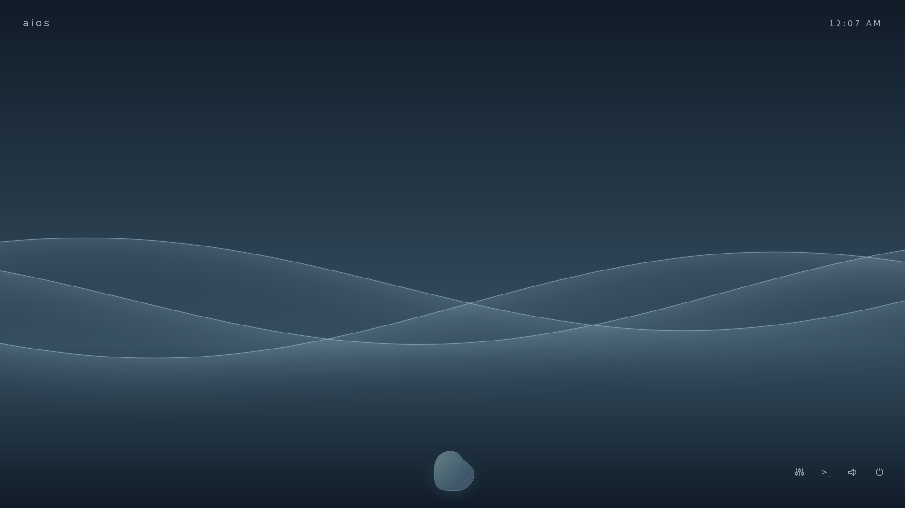
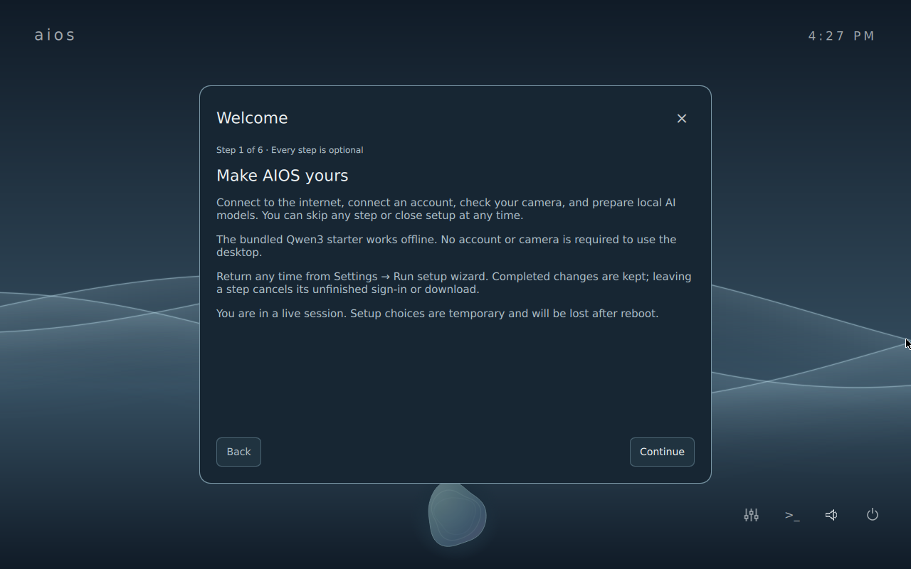
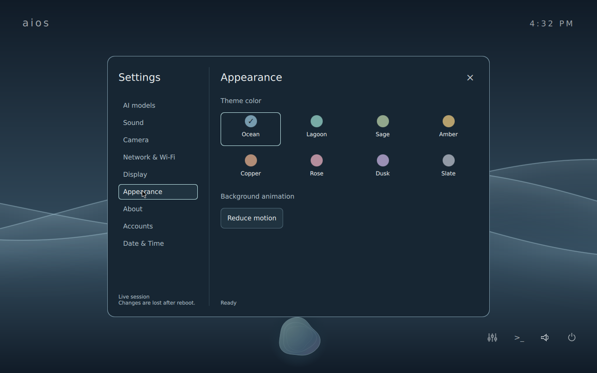

# AIOS

**An AI-only OS. Start with what you want to do.**

AIOS explores a desktop built around conversation. Open a chat, describe a task,
and let an AI work through the tools available to it. The idea is simple: make
your intent the starting point for using a computer.

Built on Alpine Linux with a native Qt desktop, AIOS brings local AI, voice,
browser tools, and on-demand applications into one quiet workspace. “AI-only”
describes the direction: AI as the primary interface to the operating system.
Today, native Settings and Terminal remain available for direct control.



[Run locally](#run-aios-locally) · [Features](#what-you-can-do) ·
[Screenshots](#inside-aios) · [Architecture](docs/architecture.md) ·
[Contribute](CONTRIBUTING.md)

> **Development preview.** AIOS boots and runs locally in QEMU. The bundled
> starter supports basic offline chat; capable agent work needs a stronger local
> or remote model. Physical hardware is not yet certified.

## A desktop built around intent

What if you could describe an outcome and have the computer help you get there?
AIOS puts that interaction at the center of the desktop, with a single chat
launcher and minimal surrounding chrome. Tools connect the conversation to
supported OS actions, web browsing, and applications.

Local inference makes basic chat available without an account or a network
connection. When a task needs more capable reasoning, choose a larger local
model, connect a compatible remote endpoint, or sign in with ChatGPT.

## What you can do

| Feature | What it gives you |
| --- | --- |
| **Chat as your starting point** | Separate conversation windows, text attachments, and a launcher that restores hidden chats so you can return to your work. |
| **AI on your computer** | A bundled Qwen3 0.6B starter for offline chat, curated larger models, and custom GGUF imports let you choose what runs locally. |
| **Your choice of provider** | Use a compatible remote endpoint or ChatGPT subscription sign-in; agent tasks can use a separate configured model. |
| **OS controls through conversation** | Tool-capable models can change volume, mute, theme, and reduced motion through structured OS operations. |
| **Applications when you need them** | Ask for a calculator to build or reuse an app. Supported requests use trusted native templates; other app types can use a sandboxed offline web app. |
| **A browser connected to your task** | A minimal native browser gives agents bounded navigation and page interaction, with an off-the-record profile scoped to each chat. |
| **Voice and attachments** | Dictate into an editable draft, hear spoken replies, and add text files for context. Local and remote speech options are supported. |
| **Skills and local MCP tools** | Extend a capable model with installed Agent Skills and explicitly approved local tool servers. |
| **A calm, personal workspace** | Wave backgrounds, coordinated palettes, and reduced-motion settings keep the desktop understated. |

Agent capabilities depend on the selected model and configured tools. The small
starter is not a reliable general-purpose tool agent; choose a stronger model
for browser and application tasks. See [local models](docs/local-models.md) and
[agentic tools](docs/agentic-tools.md) for supported operations and boundaries.

## Inside AIOS

These are actual OS captures from local development validation, not mockups.
They show the Ocean desktop and native setup and settings surfaces; the UI may
evolve between development images.

### A first run you can make your own

The optional setup wizard walks through connectivity, accounts, camera checks,
and local models. Every step can be skipped, and the bundled chat model works
without an account or camera.



### One visual language across the desktop

Choose a palette and reduce background motion from the native Appearance page.



## Run AIOS locally

The recommended way to try AIOS is to build its x86_64 live ISO and boot it in
QEMU. The entire desktop runs inside a resizable VM window.

### What you need

- **Git and Docker** with a working Linux container daemon.
- **Linux:** a graphical session and QEMU. **Windows:** PowerShell, WSL2 with
  Ubuntu, WSLg, and Docker Desktop integration enabled for that distribution.
- **Host resources:** the launcher allocates **16 GiB RAM and four CPUs** by
  default. Leave additional memory for the host and Docker. Its virtual disk is
  a **64 GiB sparse file**, which grows as data is written; builds and models
  also need free disk space.
- **Local inference:** an x86_64 CPU exposing SSE4.2, AVX, AVX2, BMI2, F16C, and
  FMA. Unsupported CPUs can still reach the desktop and use remote providers.

The first build needs internet access and can take a while. Subsequent builds
reuse the `aios-build-cache` Docker volume.

### Windows (PowerShell + WSL2)

With WSL2, Ubuntu, WSLg, and Docker Desktop configured, run in PowerShell:

```powershell
git clone https://github.com/rwrife/aios.git
cd aios

# Install the VM runtime inside WSL (one-time setup).
wsl -d Ubuntu -- sudo apt update
wsl -d Ubuntu -- sudo apt install -y qemu-system-x86 qemu-utils qemu-system-gui
wsl -d Ubuntu -- docker version

# Build the image, then launch the newest local ISO.
.\scripts\build.ps1
.\scripts\run.ps1 -Name "AIOS local preview"
```

Use `-Distro Debian` on both scripts if that is your configured distribution.
If PowerShell blocks the scripts, invoke each with
`powershell -ExecutionPolicy Bypass -File .\scripts\build.ps1` or
`powershell -ExecutionPolicy Bypass -File .\scripts\run.ps1 -Name "AIOS local preview"`.
Use `-Native` only when WSL/WSLg is unavailable or you specifically need the
native Windows QEMU fallback; it requires Windows QEMU and is slower by default.

### Linux (Debian / Ubuntu)

With Git and Docker installed and Docker accessible to your user:

```sh
git clone https://github.com/rwrife/aios.git
cd aios

sudo apt update
sudo apt install -y qemu-system-x86 qemu-utils qemu-system-gui
docker version

bash scripts/build.sh
AIOS_VM_NAME="AIOS local preview" bash scripts/run.sh
```

On other Linux distributions, install the equivalent QEMU packages.
On macOS, build with Docker Desktop and `bash scripts/build.sh`, then open the
x86_64 ISO in a compatible VM application. The included launcher targets Linux
and WSL; see [platform setup](CONTRIBUTING.md).

### Your first session

1. Wait for the desktop. The live image loads packages into RAM at boot, which
   can take several minutes, especially without KVM acceleration. The BIOS
   `boot:` prompt may remain visible during normal startup; keep waiting.
2. Complete or skip the optional setup wizard. You can reopen it from Settings.
3. Click the animated launcher at the bottom center to open a chat. The bundled
   Qwen3 starter starts automatically for basic offline conversation.
4. Open **Settings → AI models** to download a stronger model, configure a remote
   provider, or use [ChatGPT sign-in](docs/chatgpt-subscription.md). With a capable
   tool model, try “Set the volume to 35 percent” or “I need a calculator.”

**Live sessions are temporary:** settings, downloads, and conversations in the
RAM-backed live environment are lost after reboot. The launcher reuses its
virtual disk, but that alone does not make a live session persistent. For an
installed system, follow the [VM installation notes](docs/running-locally.md).

### Images, VM options, and troubleshooting

Both launchers select the newest ISO in `distro/alpine/out`. To choose one:

```powershell
.\scripts\run.ps1 C:\images\aios-x86_64.iso -Name "AIOS local preview"
```

```sh
AIOS_VM_NAME="AIOS local preview" bash scripts/run.sh /path/to/aios-x86_64.iso
```

The VM has outbound NAT networking and audio. Linux and WSL use KVM when
available; software emulation is substantially slower. Boot diagnostics are
written to `.tmp-aios-boot.log`.

See the [full running guide](docs/running-locally.md) for image downloads and
checksums, USB boot, RAM/CPU/disk overrides, KVM access, audio and graphics
troubleshooting, and installation. See the
[webcam guide](docs/wsl-webcam.md#camera-inside-the-windowed-vm) for camera passthrough.

## Explore and contribute

AIOS is under active development. Secure Boot is unsupported, physical hardware
validation remains incomplete, and coordinated system update/rollback is not
implemented. Use a disposable VM disk when trying the installer.

- [Contributing and validation](CONTRIBUTING.md)
- [Desktop vision](docs/specs/chat-desktop.md) and [architecture](docs/architecture.md)
- [Settings](docs/settings.md), [local models](docs/local-models.md), and [voice](docs/voice-and-sessions.md)
- [Agent Skills and MCP](docs/agentic-tools.md) and [browser tools](docs/browser.md)
- [Implementation evidence](docs/qa/implementation-status.md) and [installation QA](docs/qa/hardware-install-rollback.md)
